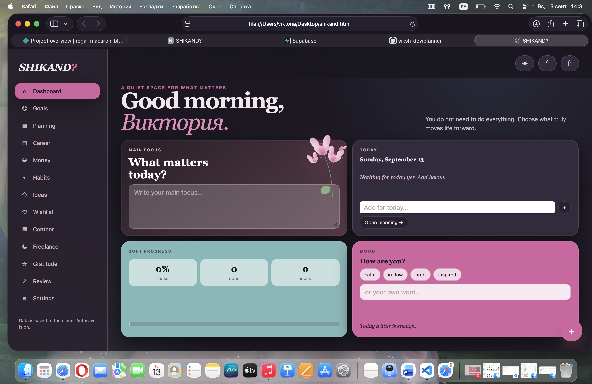
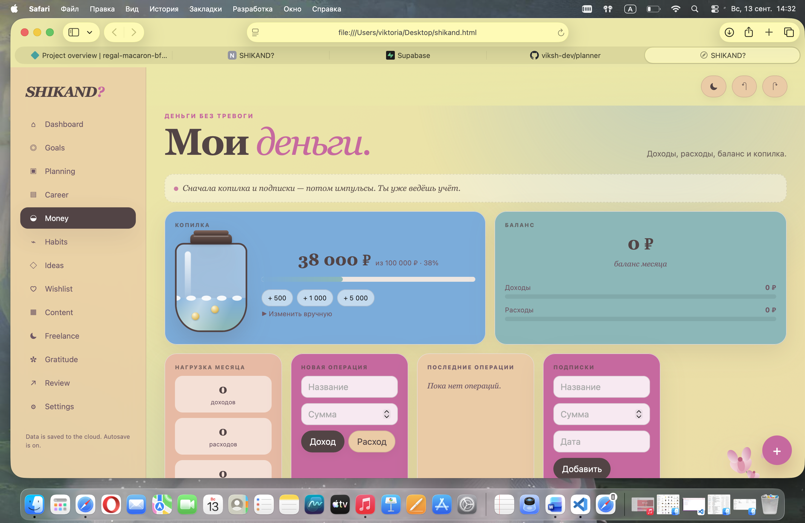
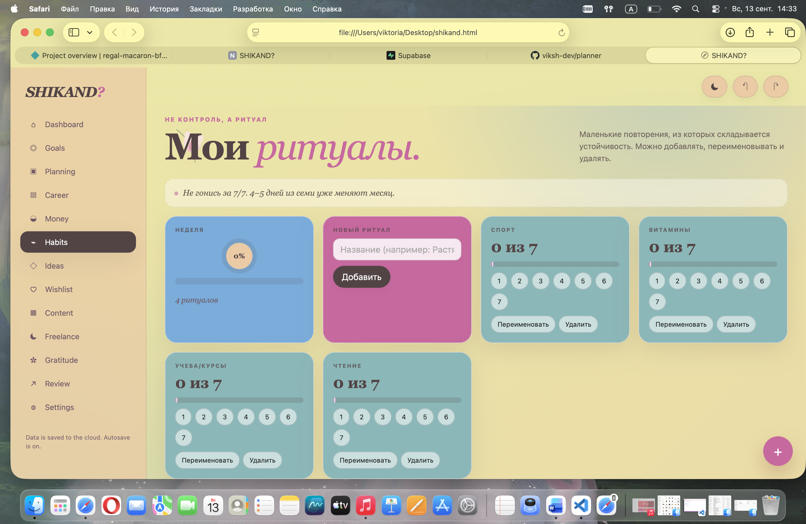
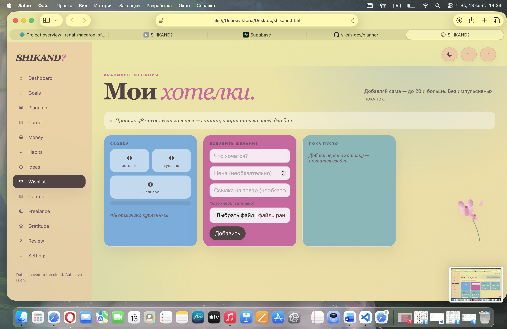
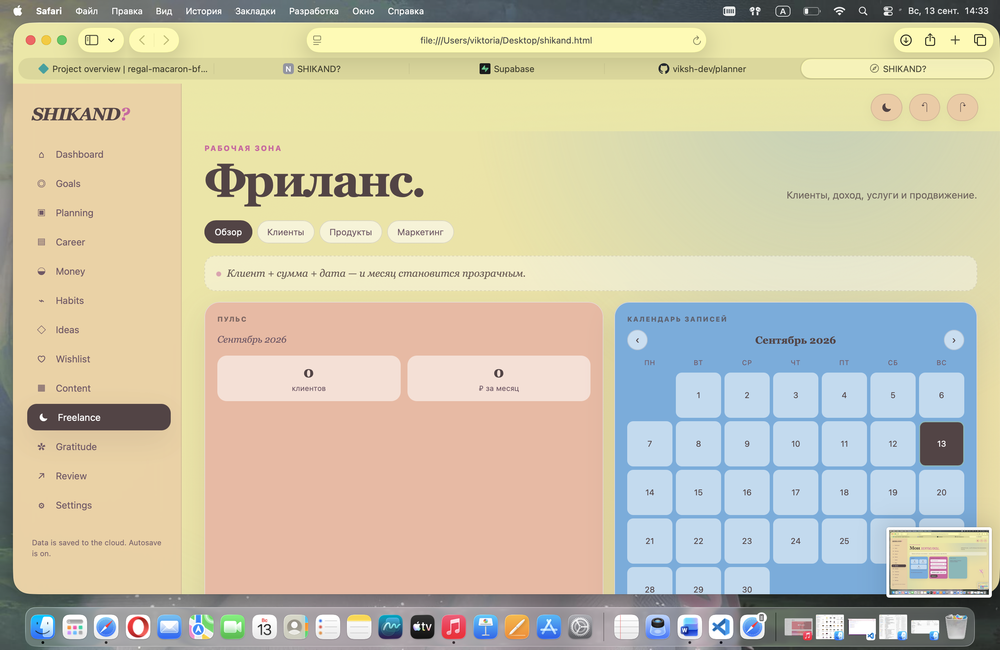
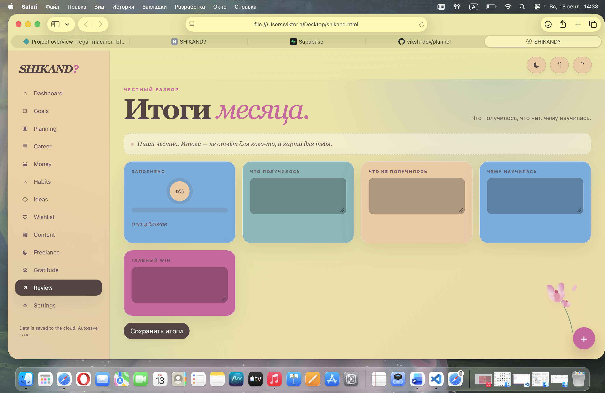

# SHIKAND?

Эстетичный личный планер без давления.

Сначала я сделала его **только для себя**. Надоело покупать красивые блокноты и почти не писать в них — жалко страницы, страшно «написать не так». Хотелось один удобный ежедневник, где можно фиксировать день, цели, деньги, привычки и мысли, не чувствуя, что сдаёшь отчёт.

Потом оказалось, что таким пространством удобно пользоваться и другим. Поэтому выложила.

Мягкий интерфейс: кремовые тона, розовый акцент, тёмная тема, ботанические детали. Один файл — и всё, что обычно разбросано по заметкам и табличкам: фокус дня, план, цели, копилка, ритуалы, хотелки, клиенты, благодарности, итоги месяца. Данные сами уходят в облако. Можно зайти с телефона или с другого ноутбука под тем же именем и паролем.

---

## Скриншоты
  
> В светлой и тёмной теме README сразу выглядит живым.

| Главная | Деньги | Привычки |
|--------|--------|----------|
|  |  |  |

| Хотелки | Фриланс | Итоги |
|---------|---------|-------|
|  |  |  |


---

## Что внутри

| Раздел | Что делает |
|--------|------------|
| **Главная** | Фокус дня, задачи, мягкий прогресс |
| **Цели** | Цели с прогрессом |
| **Планирование** | День + мини-календарь |
| **Карьера** | Проекты, статусы, следующие шаги |
| **Деньги** | Копилка, доходы/расходы, бюджеты, подписки |
| **Привычки** | Ритуалы с отметками 1–7 за неделю |
| **Идеи** | Карточки с тегами |
| **Хотелки** | Список желаний с ценой, ссылкой и фото |
| **Контент** | Идеи для постов / SMM |
| **Фриланс** | Клиенты, суммы, календарь записей, продукты, маркетинг |
| **Благодарности** | Короткие записи «за что сегодня» |
| **Итоги** | Что получилось / не получилось / чему научилась / win |
| **Настройки** | Имя, язык (RU/EN), акцент, тема, экспорт JSON, сброс |

Ничего не орёт и не требует «сделать 100%».

---

## Технологии

- Один HTML-файл (CSS + JS внутри) — без сборки  
- [Supabase](https://supabase.com) — авторизация + хранение профиля  
- `localStorage` как быстрый кэш  
- Undo / Redo  
- Адаптив под телефон  

Данные лежат в таблице `profiles` (JSONB). Доступ только к своему профилю через Row Level Security.

---

## Как поднять у себя

### 1. Supabase

1. Создай проект на [supabase.com](https://supabase.com).  
2. Открой **SQL Editor → New query** и выполни скрипт из файла `supabase-setup.sql` (или скопируй ниже).

```sql
create table if not exists public.profiles (
  id uuid references auth.users on delete cascade primary key,
  data jsonb not null default '{}'::jsonb,
  updated_at timestamptz default now()
);

alter table public.profiles enable row level security;

create policy "select own profile"
  on public.profiles for select
  using (auth.uid() = id);

create policy "insert own profile"
  on public.profiles for insert
  with check (auth.uid() = id);

create policy "update own profile"
  on public.profiles for update
  using (auth.uid() = id);
```

3. В **Authentication → Providers** Email должен быть включён.  
   **Confirm email** лучше выключить — иначе после «Создать аккаунт» сессия не появится сразу.

4. В **Project Settings → API** скопируй Project URL и `anon` key.

### 2. Код

В начале `<script>` в `index.html` вставь свои значения:

```js
const SUPABASE_URL = 'https://YOUR_PROJECT.supabase.co';
const SUPABASE_ANON_KEY = 'YOUR_ANON_KEY';
```

Открой файл в браузере или залей на любой хостинг (Netlify, GitHub Pages, Vercel).

### 3. Вход

- **Имя** — как тебя называть в приветствии  
- **Пароль** — ровно 4 символа  

Тебе не нужно помнить email — только своё имя и эти 4 символа.

«Создать аккаунт» — первый раз.  
«Войти» — все следующие входы, с любого устройства.

---

## Структура данных

Состояние — один JSON. При каждом изменении:

1. сразу пишется в `localStorage`,  
2. через ~700 мс уходит в Supabase (`profiles.data`).

Есть история для undo/redo.  
Экспорт JSON — в настройках, если хочется бэкап.

---

## Локальный запуск

Ничего ставить не нужно:

```bash
open index.html
# или
npx serve .
```

---

## Безопасность

- RLS включён: каждый видит только свою строку.  
- Пароль из 4 символов — осознанный компромисс ради простоты (это не банк).  
- `anon` key в клиенте — нормальная практика для Supabase, пока RLS не выключен.  
- Не коммить свои реальные ключи в публичный репозиторий.

---

## Автор

Виктория.  
Сначала сделала планер для себя. Потом решила, что им можно делиться.

Если пользуешься и находишь баги — пиши. Буду рада.

---


